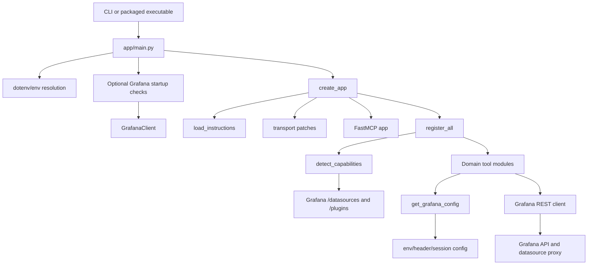
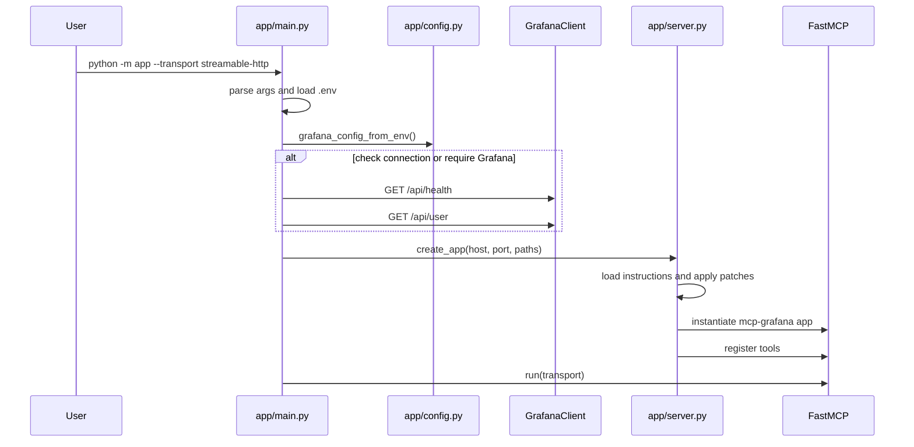
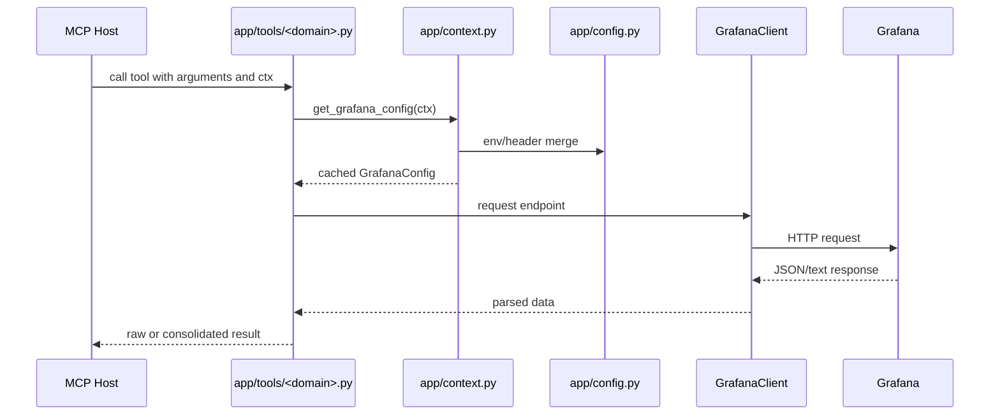
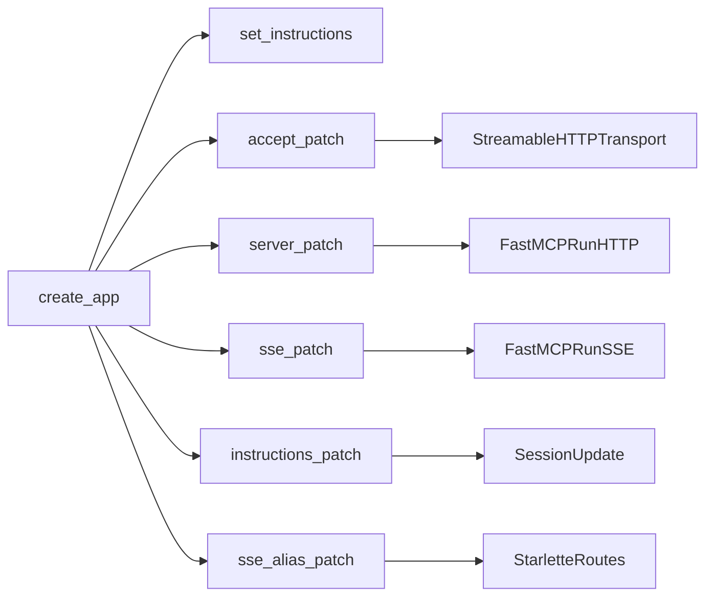

# Runtime Architecture

The architecture is a modular MCP server around a shared Grafana HTTP client and domain-specific tool modules.

## Main Components



## CLI And Startup Flow

`app/main.py` is responsible for:

- loading `.env` from the project root or fallback locations;
- applying CLI overrides to environment variables;
- configuring logging and reducing noisy loggers;
- optionally checking Grafana health/auth;
- creating the app with `create_app`;
- running the selected transport.



## Tool Execution Flow

Every MCP tool follows the same operational shape:

1. FastMCP injects `ctx`.
2. The tool validates that `ctx` is present.
3. The tool resolves `GrafanaConfig` via `get_grafana_config(ctx)`.
4. The tool creates `GrafanaClient` or a datasource proxy client.
5. The tool calls Grafana.
6. The tool returns either raw API data for detail fetches or a compact consolidated response for large/list operations.



## Transport Patch Layer

`app/patches.py` modifies upstream MCP behavior at runtime. These patches are intentional compatibility shims.

| Patch | Purpose |
| --- | --- |
| `ensure_streamable_http_accept_patch` | Allows clients that send only `text/event-stream`, wildcard, or relaxed Accept headers. |
| `ensure_streamable_http_server_patch` | Runs Streamable HTTP with configurable uvicorn timeouts. |
| `ensure_sse_server_patch` | Stores the uvicorn server instance for graceful shutdown. |
| `ensure_streamable_http_instructions_patch` | Emits `session.update` preprompt events during initialization. |
| `ensure_sse_post_alias_patch` | Allows JSON-RPC POST delivery on the SSE endpoint. |



## Capability-Gated Registration

`app/tools/__init__.py` registers always-available tools first, then skips optional domains based on Grafana capability detection.

```mermaid
flowchart TD
    RegisterAll --> Always[admin, datasources, dashboard, alerting, navigation, search]
    RegisterAll --> Detect[detect_capabilities]
    Detect --> Datasources[/datasources]
    Detect --> Plugins[/plugins]
    Detect --> Optional{Capability present?}
    Optional -->|loki datasource| Loki
    Optional -->|prometheus datasource| Prometheus
    Optional -->|pyroscope datasource| Pyroscope
    Optional -->|grafana-irm-app| IncidentAndOnCall
    Optional -->|grafana-asserts-app| Asserts
    Optional -->|grafana-ml-app| Sift
```

