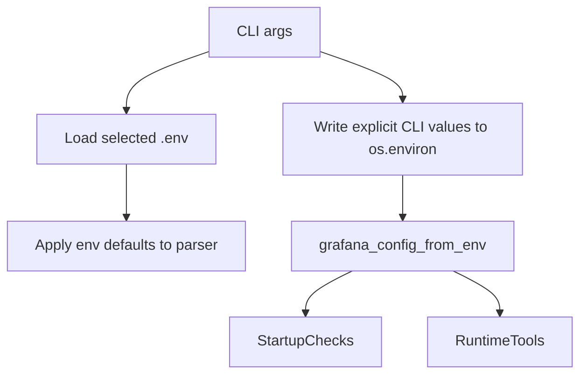

# Configuration And Security

Configuration is resolved from environment variables, CLI flags, and request headers.

## Core Environment Variables

| Variable | Purpose |
| --- | --- |
| `GRAFANA_URL` | Base Grafana URL. Defaults to `http://localhost:3000`. |
| `GRAFANA_SERVICE_ACCOUNT_TOKEN` | Preferred bearer token. |
| `GRAFANA_API_KEY` | Legacy API key fallback. Logs a deprecation warning. |
| `GRAFANA_USERNAME`, `GRAFANA_PASSWORD` | Basic auth credentials. |
| `GRAFANA_ACCESS_TOKEN`, `GRAFANA_ID_TOKEN` | OIDC-style headers forwarded to Grafana. |
| `GRAFANA_TLS_CERT_FILE`, `GRAFANA_TLS_KEY_FILE`, `GRAFANA_TLS_CA_FILE` | Client cert and CA bundle configuration. |
| `GRAFANA_TLS_SKIP_VERIFY` | Disables TLS verification when truthy. Insecure; use only for troubleshooting/self-signed setups. |
| `MCP_INSTRUCTIONS_PATH` | Overrides the default instruction text loaded into FastMCP. |
| `MCP_STREAMABLE_HTTP_TIMEOUT_*` | Controls Streamable HTTP uvicorn timeout values. |

## CLI Override Flow

`app/main.py` creates CLI flags matching Grafana env vars. When provided, CLI values are written into `os.environ` before `grafana_config_from_env()` is used.

## Header Override Flow

HTTP transports can receive request-specific Grafana configuration:

| Header | Config field |
| --- | --- |
| `x-grafana-url` | Grafana base URL |
| `x-grafana-api-key` | API key/service token |
| `authorization: Basic ...` | Basic auth |
| `authorization: Bearer ...` | Access token fallback |
| `x-access-token` | Access token |
| `x-grafana-id` | ID token |

`app/context.py` caches the resolved `GrafanaConfig` in `ctx.request_context.session` so repeated tool calls in a session do not rebuild it.

## Authentication Header Behavior

`GrafanaClient` builds headers as follows:

- `Authorization: Bearer <api_key>` when `api_key` exists;
- `X-Access-Token` and `X-Grafana-Id` when both OIDC token fields exist;
- extra headers from a caller override or extend defaults;
- basic auth is passed through HTTPX `BasicAuth`, not manually encoded.

## Startup Checks

By default, non-test execution requires Grafana startup checks unless `--no-require-grafana` is passed. The checks:

1. call `/api/health` to validate reachability and TLS;
2. verify the payload resembles Grafana;
3. require at least one auth method;
4. call `/api/user` with a short timeout.

Special handling:

- `401` is fatal;
- `403` or `404` with token auth is warning-only because service account tokens may be valid without user endpoint access;
- failures exit with status code `2`.

## Instruction Loading

Instruction text comes from:

1. `MCP_INSTRUCTIONS_PATH`, if set;
2. `instructions.md` in the current working directory;
3. packaged `app/instructions.md`, if present;
4. built-in default text.

Placeholders like `{{DASH_UID}}` are resolved from environment variables. Unknown placeholders are preserved.

## Security Notes For Changes

- Never log secret values; log booleans such as `api_key_set`.
- Keep TLS skip behavior explicit and documented.
- Preserve request-header override behavior for multi-tenant MCP hosts.
- Be careful when changing `OnCallClient._headers`: its Authorization value currently differs from `GrafanaClient` and should be tested before modification.

