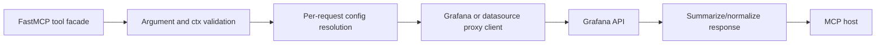
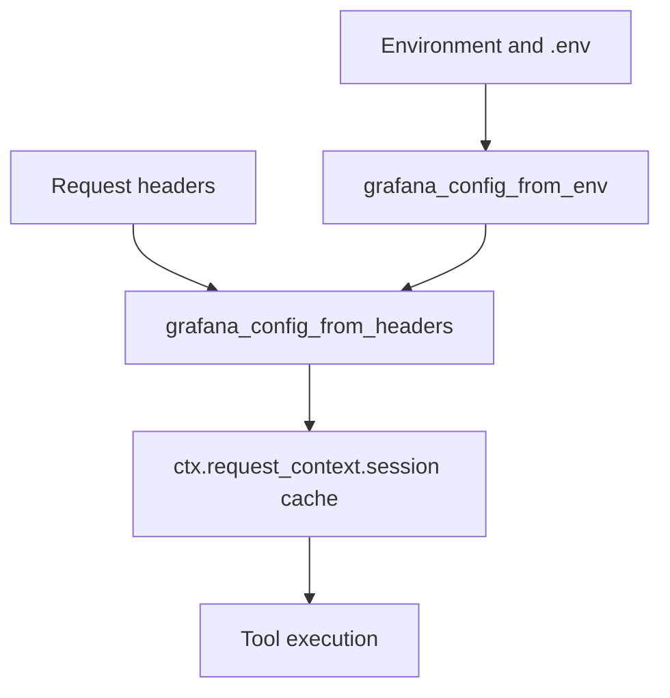

# Code Patterns

The project has clear local patterns, even where it does not map perfectly to a named enterprise architecture. The best name for the project-specific pattern is:

## Project Pattern: Capability-Gated MCP Tool Facade

The server is a facade from MCP tool calls to Grafana APIs. It exposes small domain tools, resolves per-request config, calls Grafana through shared clients, and returns agent-friendly responses.



## Known Patterns Present

| Pattern | Where | How it appears | Example |
| --- | --- | --- | --- |
| Factory | `app/server.py` | `create_app` builds and configures the FastMCP app. | [Factory example](#factory-example) |
| Registry | `app/tools/__init__.py` | `register_all` registers every domain module. | [Registry example](#registry-example) |
| Facade | `app/tools/*.py` | MCP tools hide Grafana HTTP details behind simple calls. | [Facade example](#facade-example) |
| Adapter | `app/grafana_client.py`, proxy clients | Translates local config into HTTPX requests and headers. | [Adapter example](#adapter-example) |
| Capability gating | `app/tools/availability.py` | Optional tools are enabled only when datasource/plugin support exists. | [Capability gating example](#capability-gating-example) |
| Session cache | `app/context.py`, `app/tools/dashboard.py` | Reuses config and dashboard payloads within the MCP session. | [Session cache example](#session-cache-example) |
| Compatibility shim | `app/patches.py`, `mcp/server/*` | Patches or stubs upstream MCP behavior for host compatibility and tests. | [Compatibility shim example](#compatibility-shim-example) |
| DTO/schema model | `DashboardPatchOperation` | Uses Pydantic for structured dashboard patch operations. | [DTO/schema model example](#dto-schema-model-example) |

## Standard Tool Module Pattern

Most tool modules should follow this structure:

```python
from mcp.server.fastmcp import Context, FastMCP

from ..context import get_grafana_config
from ..grafana_client import GrafanaClient


async def _domain_helper(ctx: Context, arg: str):
    config = get_grafana_config(ctx)
    client = GrafanaClient(config)
    return await client.get_json("/path")


def register(app: FastMCP) -> None:
    @app.tool(name="tool_name", title="Tool title", description="...")
    async def tool_name(arg: str, ctx: Context | None = None):
        if ctx is None:
            raise ValueError("Context injection failed for tool_name")
        return await _domain_helper(ctx, arg)
```

## Response Pattern

Large list operations usually return consolidated objects:

```json
{
  "items": [],
  "total_count": 0,
  "query": "",
  "type": "domain_result"
}
```

This is intentional. It avoids raw-array chunking issues in Streamable HTTP clients and gives agents stable metadata.

Detail fetches often return raw Grafana payloads because agents may need the complete object before editing.

## Configuration Pattern

The configuration layer has three levels:

1. Environment variables and CLI flags.
2. HTTP request headers for per-request overrides.
3. Session cache to avoid rebuilding config repeatedly.



## Error Handling Pattern

- `GrafanaClient` raises `GrafanaAPIError` for HTTP status `>= 400`.
- Tool helpers convert expected 404s or invalid inputs into `ValueError`.
- Unexpected payload shape is treated as `ValueError` instead of guessing.
- Startup checks use process exit code `2` for connection/auth failures.

## Naming Pattern

- Public tool parameters use Grafana/API-friendly camelCase where exposed to hosts: `datasourceUid`, `startRfc3339`, `folderUid`.
- Internal helpers use Python snake_case.
- Tool names are snake_case and domain-prefixed when helpful: `list_loki_label_names`, `query_prometheus`, `fetch_pyroscope_profile`.

## Edit Pattern For New Work

1. Find the domain module in `app/tools/`.
2. Add private helper functions before `register`.
3. Add or adjust one `@app.tool` wrapper inside `register`.
4. Reuse `get_grafana_config` and `GrafanaClient`.
5. Add a focused test in `tests/test_tools_<domain>.py`.
6. If the tool is optional, update capability tests.
7. Preserve consolidated response format for list/search/update operations.

## Pattern Code Examples

These examples are copied or reduced from the project code so agents can recognize the local implementation style quickly.

### Factory Example

Source: `app/server.py`

```python
def create_app(
    *,
    host: str,
    port: int,
    base_path: str = "/",
    streamable_http_path: str = "mcp",
    log_level: str = "INFO",
    debug: bool = False,
) -> FastMCP:
    instructions = load_instructions()
    set_streamable_http_instructions(instructions)

    ensure_streamable_http_accept_patch()
    ensure_streamable_http_server_patch()
    ensure_sse_server_patch()
    ensure_streamable_http_instructions_patch()
    ensure_sse_post_alias_patch()

    app = FastMCP(
        name="mcp-grafana",
        instructions=instructions,
        host=host,
        port=port,
        streamable_http_path=resolved_streamable_http_path,
        log_level=log_level.upper(),
        debug=debug,
    )
    register_all(app)
    _register_streamable_http_alias(app)
    return app
```

Why this is the Factory pattern:

- call sites do not assemble `FastMCP` directly;
- setup order is centralized;
- instruction loading, patching, route calculation, tool registration, and alias registration are hidden behind one creation function.

### Registry Example

Source: `app/tools/__init__.py`

```python
def register_all(app: FastMCP) -> None:
    capabilities = _resolve_capabilities()

    def _register(
        name: str,
        register_func: Callable[[FastMCP], None],
        *,
        supported: bool = True,
        reason: str | None = None,
    ) -> None:
        if supported:
            register_func(app)
            return
        message = reason or "required Grafana capability is not available"
        LOGGER.info("Skipping registration of %s tools: %s", name, message)

    _register("admin", admin.register)
    _register("datasources", datasources.register)
    _register("dashboard", dashboard.register)
    _register("alerting", alerting.register)
    _register("navigation", navigation.register)
    _register("search", search.register)
```

Why this is the Registry pattern:

- each domain module owns its `register(app)` function;
- one central registry composes the complete MCP tool surface;
- optional modules are included or skipped from the same place.

### Facade Example

Source: `app/tools/search.py`

```python
@app.tool(
    name="search",
    title="Search Grafana",
    description=(
        "General purpose search endpoint used by MCP clients. Returns a "
        "consolidated response object containing matching dashboard metadata, "
        "total count, and query info."
    ),
)
async def search(
    query: str,
    ctx: Optional[Context] = None,
) -> Any:
    if ctx is None:
        raise ValueError("Context injection failed for search")
    normalized_query = _normalize_search_query(query)
    return await _search_dashboards(normalized_query, ctx)
```

Why this is the Facade pattern:

- the MCP host sees one simple tool;
- URL construction, config resolution, and Grafana search API details are hidden;
- the response is shaped for the agent instead of mirroring the low-level API directly.

### Adapter Example

Source: `app/grafana_client.py`

```python
@dataclass
class GrafanaClient:
    config: GrafanaConfig
    _base_url: str = field(init=False, repr=False)
    _verify: bool | str = field(init=False, repr=False)
    _cert: Optional[tuple[str, str]] = field(init=False, repr=False)

    def __post_init__(self) -> None:
        self._base_url = _build_api_base_url(self.config.url)
        tls = self.config.tls_config
        if tls is not None:
            self._verify = tls.resolve_verify()
            self._cert = tls.resolve_cert()
        else:
            self._verify = True
            self._cert = None

    async def get_json(self, path: str, *, params=None, timeout=None) -> Any:
        response = await self.request("GET", path, params=params, timeout=timeout)
        return response.json()
```

Why this is the Adapter pattern:

- the rest of the code works with `GrafanaConfig` and simple paths;
- HTTPX-specific details stay inside the client;
- URL normalization, TLS, auth, headers, and response parsing are adapted into a project-specific interface.

### Capability Gating Example

Source: `app/tools/__init__.py`

```python
has_irm_plugin = capabilities.has_plugin("grafana-irm-app")

_register(
    "incident",
    incident.register,
    supported=has_irm_plugin,
    reason="requires the Grafana Incident plugin (grafana-irm-app)",
)
_register(
    "loki",
    loki.register,
    supported=capabilities.has_datasource_type("loki"),
    reason="requires a Grafana Loki datasource",
)
```

Why this is capability gating:

- the tool list is shaped by the actual Grafana instance;
- unsupported plugin/datasource tools are not exposed to hosts;
- skipped registrations are logged with a reason.

### Session Cache Example

Source: `app/context.py`

```python
def get_grafana_config(ctx: Context) -> GrafanaConfig:
    state = _session_state(ctx)
    config = state.get(_CONFIG_KEY)
    if isinstance(config, GrafanaConfig):
        return config

    config = _build_config(ctx)
    state[_CONFIG_KEY] = config
    return config
```

Source: `app/tools/dashboard.py`

```python
def _dashboard_cache(ctx: Context) -> Dict[str, Any]:
    session = ctx.request_context.session
    cache = getattr(session, _CACHE_KEY, None)
    if cache is None:
        cache = {}
        setattr(session, _CACHE_KEY, cache)
    return cache
```

Why this is session caching:

- repeated tool calls in one MCP session reuse resolved config;
- dashboard payloads can be reused within a session;
- cached payloads are deep-copied to avoid accidental mutation leaks.

### Compatibility Shim Example

Source: `app/patches.py`

```python
def ensure_streamable_http_accept_patch() -> None:
    global _PATCH_ACCEPT_APPLIED
    if _PATCH_ACCEPT_APPLIED:
        return

    original_check = StreamableHTTPServerTransport._check_accept_headers

    def patched_check_accept_headers(
        self: StreamableHTTPServerTransport,
        request: Request,
    ) -> tuple[bool, bool]:
        accept_header = request.headers.get("accept", "")
        if not accept_header.strip():
            return True, True
        # relaxed media-type handling omitted here
        return has_json, has_sse

    StreamableHTTPServerTransport._check_accept_headers = patched_check_accept_headers
    setattr(
        StreamableHTTPServerTransport,
        "_original_check_accept_headers",
        original_check,
    )
    _PATCH_ACCEPT_APPLIED = True
```

Why this is a compatibility shim:

- upstream behavior is adjusted at runtime without forking the dependency;
- original implementation is retained for testability/debugging;
- idempotent flags prevent repeated patching.

### DTO/Schema Model Example

Source: `app/tools/dashboard.py`

```python
class DashboardPatchOperation(BaseModel):
    """Structured representation of a JSON patch operation for dashboards."""

    op: str = Field(
        description="Operation to perform (supported: add, remove, replace)",
        pattern="^(add|remove|replace)$",
    )
    path: str = Field(
        description="JSONPath identifying the dashboard field to modify"
    )
    value: Any | None = Field(
        default=None,
        description="Value to apply for add/replace operations. Omit for remove operations.",
    )

    model_config = ConfigDict(populate_by_name=True)
```

Why this is a DTO/schema model:

- dashboard patch operations have an explicit public shape;
- validation documents allowed operations;
- the schema can be exposed through FastMCP tool parameter generation.
