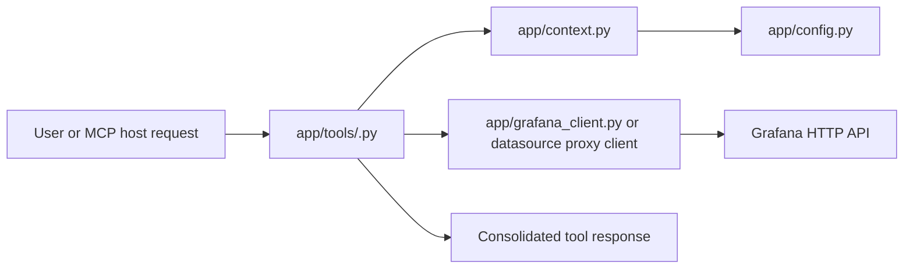

# Project Documentation Index

This folder is a compact routing map for `grafanaFastMCP`. Do not read every file by default.

## Minimum Input Path

1. Pick the task type in [Context Packs](./CONTEXT-PACKS.md).
2. Locate owner and closest test in [Semantic Map](./SEMANTIC-MAP.md).
3. Read only the owner file, closest test, and one deep reference if blocked.

## Deep References

Use these only when the compact path is insufficient:

- [Architecture](./ARCHITECTURE.md)
- [Patterns](./PATTERNS.md)
- [Tool Modules](./TOOL-MODULES.md)
- [Testing](./TEST-QUALITY.md)
- [Config/Security](./CONFIG-SECURITY.md)
- [Tokenomics Applicability](./TOKENOMICS-APPLICABILITY.md)

## High-Value Rule For Agents

Most changes should start from the relevant tool module in `app/tools/`, then follow the shared path:

Avoid broad scans. `DESIGN` should usually stop after one context pack, the semantic map, one owner file, and one test. `CODE_COMPLETION` should start from `git diff`, not from docs.

For token-cost experiments, use [Tokenomics Applicability](./TOKENOMICS-APPLICABILITY.md) to verify which paper recommendations are implemented through documentation, which belong in `tokenomics.experiment/`, and which generic architecture examples do not apply to this codebase.
