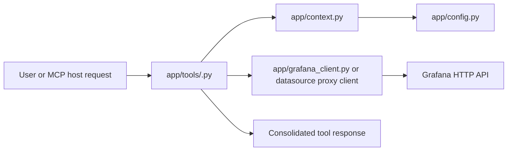

# Project Documentation Index

This folder is the fast onboarding map for `grafanaFastMCP`. It documents the project shape, runtime architecture, code patterns, tool domains, test strategy, and development workflow so a person or agent can start coding with minimal rediscovery.

## Recommended Reading Order

1. [Base](./base.md)
2. [Project Overview](./project-overview.md)
3. [Directory Tree](./directory-tree.md)
4. [Runtime Architecture](./runtime-architecture.md)
5. [Code Patterns](./code-patterns.md)
6. [Tool Modules](./tool-modules.md)
7. [Configuration And Security](./configuration-and-security.md)
8. [Testing And Quality](./testing-and-quality.md)
9. [Agent Onboarding Guide](./agent-onboarding-guide.md)
10. [Tokenomics Applicability](./tokenomics-applicability.md)

## High-Value Rule For Agents

Most changes should start from the relevant tool module in `app/tools/`, then follow the shared path:

Avoid broad scans after reading this folder. Use these docs to jump directly to the correct module, helper, and test file.

For token-cost experiments, use [Tokenomics Applicability](./tokenomics-applicability.md) to verify which paper recommendations are implemented through documentation, which belong in `tokenomics.experiment/`, and which generic architecture examples do not apply to this codebase.
