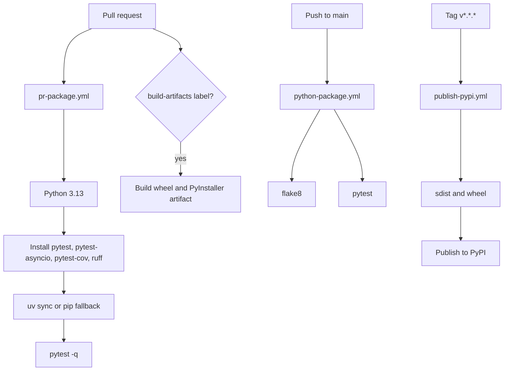

# Testing And Quality

The repository has focused pytest coverage for configuration, startup, transports, capability registration, schema generation, client behavior, and each major tool domain.

## Test Layout

| Test file pattern | Coverage area |
| --- | --- |
| `tests/test_config*.py` | Environment/header config, TLS, auth extraction. |
| `tests/test_context.py` | Session-level config resolution and caching. |
| `tests/test_main*.py` | CLI parsing, env loading, startup checks, transport run calls. |
| `tests/test_server.py` | Path normalization, app creation, streamable alias route. |
| `tests/test_patches*.py` | Transport monkey patches and preprompt behavior. |
| `tests/test_fastmcp*.py` | Local FastMCP shim schema and STDIO behavior. |
| `tests/test_tool_availability.py` | Datasource/plugin capability detection. |
| `tests/test_tools_registration.py` | Conditional registration and schema item validation. |
| `tests/test_tools_<domain>.py` | Domain-specific tool helpers and wrappers. |
| `tests/test_tokenomics_normalize.py` | Tokenomics log normalization. |

## Stub Runtime

`tests/conftest.py` sets:

```text
GRAFANA_FASTMCP_USE_STUB=1
```

This keeps the lightweight local MCP shim active in tests even when the real package is installed.

## Quality Commands

Preferred:

```sh
uv run pytest
uv run ruff check .
uv run mypy app tests
```

Makefile aliases:

```sh
make uv-test
make uv-lint
make uv-typecheck
```

Fallback:

```sh
pytest
flake8 .
```

## CI



## Testing Pattern For A New Tool

1. Unit test private helper behavior directly.
2. Register the tool on a `FastMCP` instance if schema or public registration matters.
3. Mock `GrafanaClient` or its methods instead of hitting a real Grafana instance.
4. Validate bad payloads and 404 behavior where relevant.
5. If the tool accepts arrays, ensure generated schema includes `items`.
6. If the tool is capability-gated, update registration tests.

## Local Environment Caveat

The repository may contain an old `.venv` whose shebang points to a missing Homebrew Python. If `uv`, `pytest`, or `.venv/bin/pytest` fail locally, recreate the environment with `uv sync --dev --all-extras` or `make venv`.

