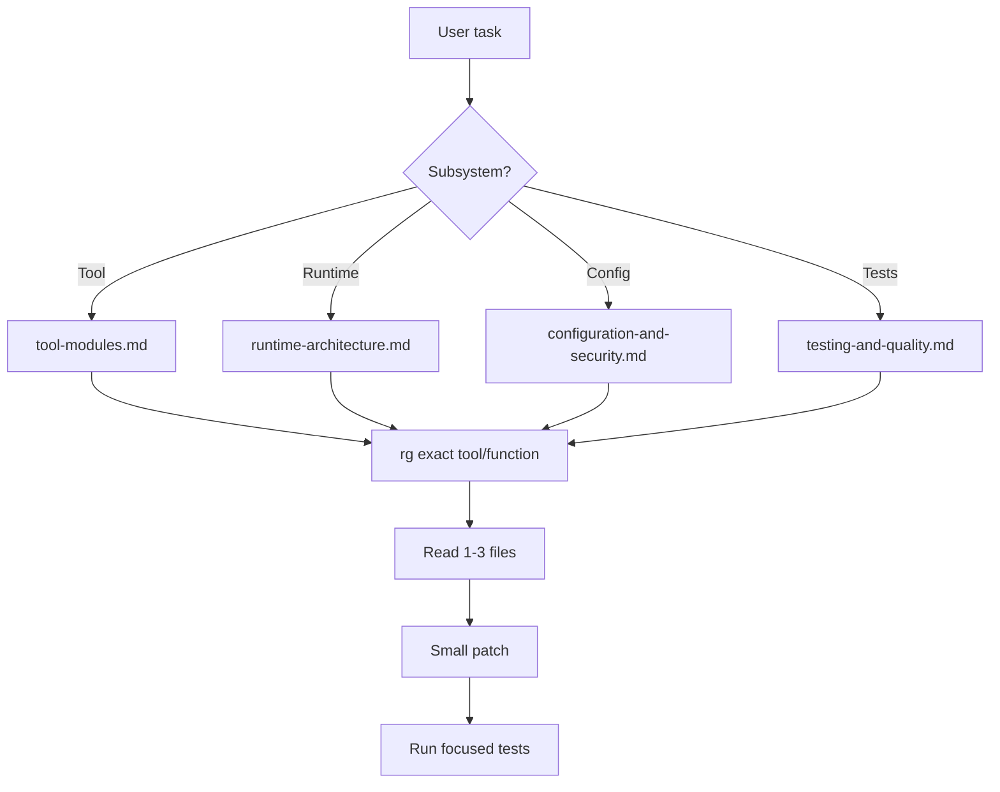

# Agent Onboarding Guide

Use this guide to reduce token cost when starting work in this repository.

## First Five Minutes

1. Read this folder, especially `project-overview.md`, `runtime-architecture.md`, and `code-patterns.md`.
2. Identify the subsystem:
   - CLI/config: `app/main.py`, `app/config.py`;
   - transport: `app/server.py`, `app/patches.py`;
   - Grafana HTTP behavior: `app/grafana_client.py`;
   - tool behavior: `app/tools/<domain>.py`;
   - tests: matching `tests/test_*.py`.
3. Search narrowly with `rg` before opening many files.
4. Prefer localized patches and focused tests.
5. Preserve consolidated response formats.

## Common Tasks

| Task | Start here | Also inspect |
| --- | --- | --- |
| Add a new Grafana tool | `app/tools/<domain>.py` | `tests/test_tools_<domain>.py`, `app/tools/__init__.py` |
| Fix auth/env behavior | `app/config.py` | `tests/test_config.py`, `env.example`, `README.md` |
| Fix HTTP request behavior | `app/grafana_client.py` | `tests/test_grafana_client.py` |
| Fix path/transport behavior | `app/server.py`, `app/patches.py` | `tests/test_server.py`, `tests/test_patches.py` |
| Fix schema validation | `mcp/server/fastmcp.py` | `tests/test_fastmcp_schema_normalization.py`, `tests/test_tools_registration.py` |
| Add tokenomics instrumentation | `tokenomics.experiment/` | `tests/test_tokenomics_normalize.py`, `AGENTS.md` |

## Decision Rules

- Do not rewrite a tool module when a helper edit is enough.
- Do not bypass `get_grafana_config(ctx)`.
- Do not instantiate HTTPX directly unless implementing a datasource proxy client pattern like Prometheus/Loki/OnCall.
- Do not expose optional tools without capability gating.
- Do not return huge raw arrays for list/search/update operations when a consolidated object is already the local pattern.
- Do not silently swallow unexpected Grafana payload shapes; raise `ValueError`.

## Minimal Read Strategy

## Definition Of Done For Agents

- Relevant tests were added or updated.
- `uv run pytest` and `uv run ruff check .` were attempted.
- Any unavailable local tooling is reported clearly.
- Documentation was updated only if public behavior or workflow changed.
- Tokenomics branch work keeps instrumentation separate from MCP runtime behavior unless explicitly requested.

