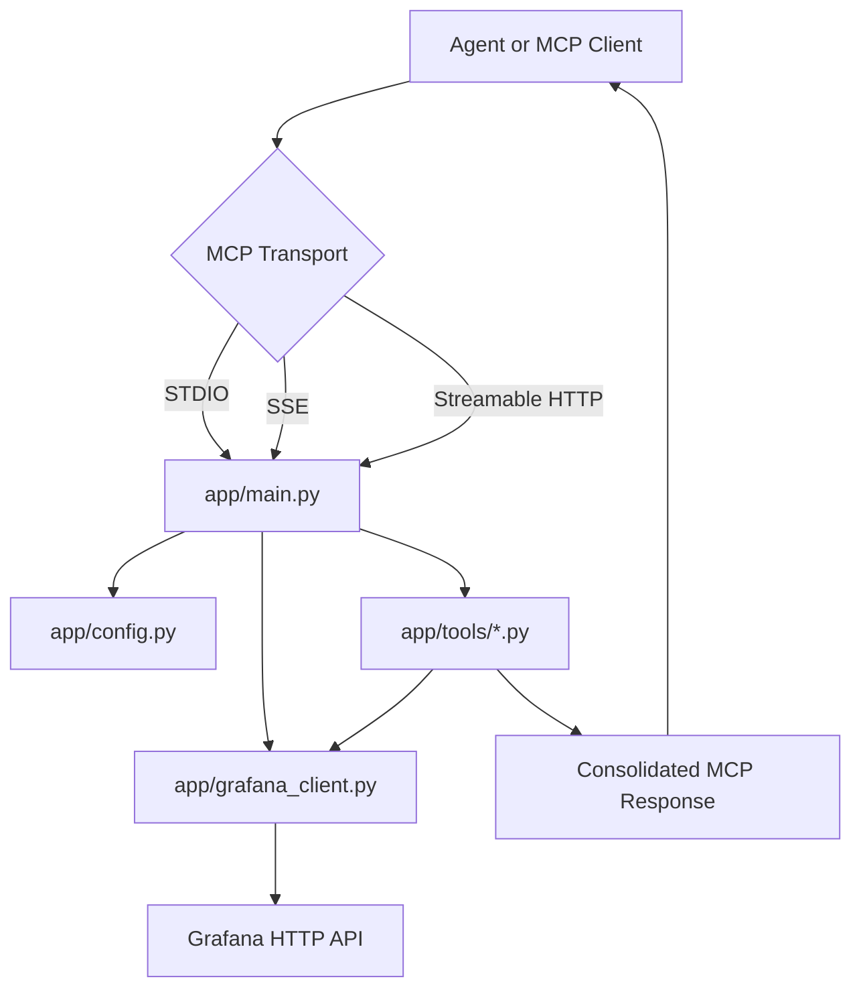
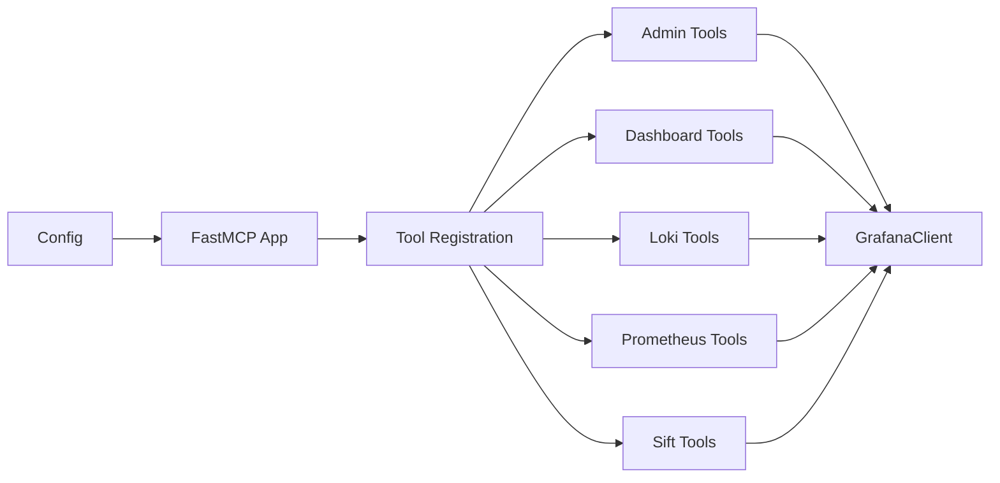

# grafanaFastMCP Project Base

## Documentation Index

- [Project overview](./project-overview.md)
- [Directory tree](./directory-tree.md)
- [Runtime architecture](./runtime-architecture.md)
- [Code patterns](./code-patterns.md)
- [Tool modules](./tool-modules.md)
- [Configuration and security](./configuration-and-security.md)
- [Testing and quality](./testing-and-quality.md)
- [Agent onboarding guide](./agent-onboarding-guide.md)
- [Tokenomics applicability](./tokenomics-applicability.md)

## What This Project Is

`grafanaFastMCP` is a Python MCP server and CLI that exposes Grafana APIs as Model Context Protocol tools. It allows agentic clients such as ChatGPT/OpenAI-compatible MCP hosts, Claude Desktop, and local automation agents to inspect Grafana dashboards, datasources, logs, incidents, alerts, on-call data, Prometheus metrics, Pyroscope profiles, and Sift investigations.

The project is designed to work well with agentic hosts. Besides calling the Grafana API, it handles MCP transport compatibility, tool schemas, session instructions, connection checks, and consolidated tool responses that reduce Streamable HTTP chunking problems.

## Primary Technologies

| Area | Technology |
| --- | --- |
| Language | Python 3.13+ |
| MCP framework | FastMCP |
| HTTP client | `httpx.AsyncClient` |
| CLI/runtime | `python -m app` and `grafana-fastmcp` package entrypoint |
| Dependency manager | `uv` / `uvx` |
| Packaging | `pyproject.toml`, Hatchling, PyInstaller support |
| Testing | Pytest |
| Linting | Ruff, plus legacy flake8 guidance where applicable |
| Configuration | CLI flags, environment variables, optional `.env` |
| Target platform | Grafana HTTP API |
| Transports | STDIO, SSE, Streamable HTTP |

## Runtime Shape

The application starts in `app/main.py`, loads configuration through `app/config.py`, creates a shared Grafana client from `app/grafana_client.py`, then registers tool modules from `app/tools/`.

## Core Execution Model

1. The process starts from `python -m app` or the packaged `grafana-fastmcp` command.
2. CLI flags and environment variables are normalized into runtime settings.
3. The application may verify Grafana reachability and authentication at startup.
4. FastMCP is configured with one of the supported transports.
5. Tool modules register focused operations against the MCP server.
6. Tool calls use the shared async Grafana client.
7. Responses are normalized for MCP clients and Streamable HTTP compatibility.

## Important Runtime Concepts

| Concept | Meaning |
| --- | --- |
| MCP server | The FastMCP app that publishes tools to agentic clients. |
| Transport | The protocol used by the client to communicate with the MCP server. |
| Tool module | A focused file under `app/tools/` that registers one Grafana capability group. |
| Grafana client | Shared async HTTP client that handles URL building, auth, TLS, and JSON helpers. |
| Capability gating | Conditional exposure of tools based on Grafana capabilities or integration availability. |
| Consolidated response | A stable response envelope for list-like tools, preserving metadata and reducing JSON chunking issues. |

## Main Code Areas

| Path | Purpose |
| --- | --- |
| `app/main.py` | Process entrypoint, CLI parsing, transport setup, tool registration, startup checks. |
| `app/config.py` | Environment and CLI configuration model. |
| `app/grafana_client.py` | Async Grafana API client and connection validation. |
| `app/tools/` | MCP tool groups for Grafana APIs. |
| `app/instructions.py` | Runtime instruction loading for MCP session initialization. |
| `mcp/` | Local compatibility/support package used by the project. |
| `tests/` | Unit tests and regression tests for config, runtime behavior, and tools. |
| `tokenomics.experiment/` | Experimental harness for measuring and reducing agent token usage. |
| `docs/project-documentation/` | Human and agent onboarding documentation. |

## Local Project Pattern

The project follows a local pattern named **Capability-Gated MCP Tool Facade**: a modular MCP facade where tool modules are registered conditionally, all Grafana HTTP access is centralized through a shared client, and responses are shaped for agentic clients.

## How To Start Coding Quickly

1. Read [project overview](./project-overview.md) and [runtime architecture](./runtime-architecture.md).
2. Use [directory tree](./directory-tree.md) to locate the relevant module.
3. Check [code patterns](./code-patterns.md) before introducing new structure.
4. If adding a Grafana API operation, inspect the closest existing tool module in `app/tools/`.
5. Add focused tests under `tests/`.
6. Run `uv run pytest` and `uv run ruff check .`.

## Advanced Agent instructions
- Read only files directly related to the task.
- Never scan the entire project unless necessary.
- Never refactor code outside the explicit scope.
- Prefer incremental patching over full rewrites.
- If the same file is changed more than three times, reassess the strategy.
- Keep changes localized.
- Before coding, identify:
  - modules
  - dependencies
  - entrypoints
  - contracts
- Maintain a semantic map of the project.
- Continuously document architectural decisions.
- Record discovered APIs, contracts, and patterns.
- Avoid changing multiple bounded contexts at the same time.
- Always return after a task/iteration, time taken and used tokens by phase `DESIGN`, `CODING`, `CODE_COMPLETION`, `CODE_REVIEW`, `TESTING`, and `DOCUMENTATION`.

## Tokenomics Note

This branch is also used to instrument token-cost reduction techniques. Treat `tokenomics.experiment/` and these project documents as agent onboarding aids that reduce repeated exploration. They should not change MCP runtime behavior unless a task explicitly asks for that promotion.

Use [tokenomics applicability](./tokenomics-applicability.md) to map paper recommendations to repository artifacts before adding new experiment controls. Generic architecture examples from the paper should be translated to the local **Capability-Gated MCP Tool Facade** pattern instead of copied literally.
