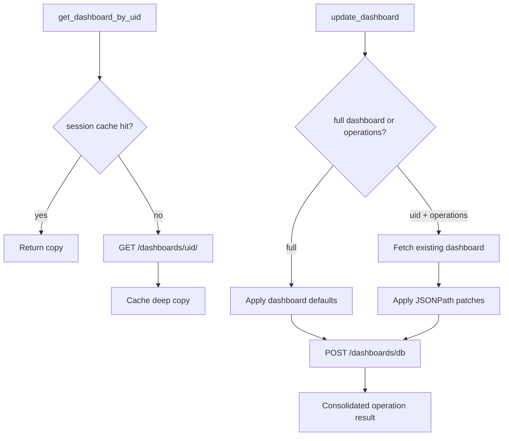
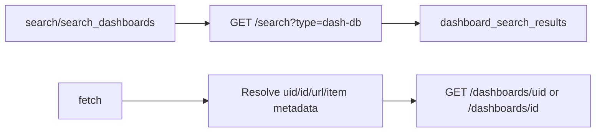

# Tool Modules

All MCP tools live in `app/tools/`. Each module exposes a single `register(app: FastMCP)` function.

## Registration Matrix

| Module | Tool names | Registration condition |
| --- | --- | --- |
| `admin.py` | `list_teams`, `list_users_by_org`, `get_grafana_versions` | Always registered. |
| `datasources.py` | `list_datasources`, `get_datasource_by_uid`, `get_datasource_by_name` | Always registered. |
| `dashboard.py` | `get_dashboard_by_uid`, `update_dashboard`, `get_dashboard_panel_queries`, `get_dashboard_property`, `get_dashboard_summary` | Always registered. |
| `alerting.py` | `list_alert_rules`, `get_alert_rule_by_uid`, `list_contact_points` | Always registered. |
| `navigation.py` | `generate_deeplink` | Always registered. |
| `search.py` | `search_dashboards`, `search`, `fetch` | Always registered. |
| `asserts.py` | `get_assertions` | Requires plugin `grafana-asserts-app`. |
| `incident.py` | `list_incidents`, `create_incident`, `add_activity_to_incident`, `get_incident` | Requires plugin `grafana-irm-app`. |
| `oncall.py` | `list_oncall_schedules`, `get_oncall_shift`, `get_current_oncall_users`, `list_oncall_teams`, `list_oncall_users` | Requires plugin `grafana-irm-app`. |
| `loki.py` | `list_loki_label_names`, `list_loki_label_values`, `query_loki_logs`, `query_loki_stats` | Requires Loki datasource type. |
| `prometheus.py` | `list_prometheus_metric_metadata`, `query_prometheus`, `list_prometheus_metric_names`, `list_prometheus_label_names`, `list_prometheus_label_values` | Requires Prometheus datasource type. |
| `pyroscope.py` | `list_pyroscope_label_names`, `list_pyroscope_label_values`, `list_pyroscope_profile_types`, `fetch_pyroscope_profile` | Requires Pyroscope datasource type. |
| `sift.py` | `get_sift_investigation`, `get_sift_analysis`, `list_sift_investigations`, `find_error_pattern_logs`, `find_slow_requests` | Requires plugin `grafana-ml-app`. |

## Dashboard Tools

`dashboard.py` is the richest tool module. It contains:

- a session-level dashboard payload cache;
- fetch by UID;
- full dashboard update/create;
- targeted patch operations through simplified JSONPath;
- panel query extraction;
- dashboard summary extraction.



Important dashboard conventions:

- `overwrite` defaults to `True`;
- existing dashboards with numeric `id` force overwrite;
- env defaults may set schema version, time range, dashboard UID, folder UID, and Prometheus datasource UID;
- patch operations support `add`, `replace`, and `remove`;
- wildcard JSONPath is allowed for reading but not modification.

## Search And Fetch

`search.py` implements the OpenAI MCP-friendly `search` and `fetch` contract.



Use `search` when a host expects the generic MCP search endpoint. Use `fetch` to retrieve full dashboard payloads from search results.

## Admin Inventory

`admin.py` includes `get_grafana_versions` for compact instance inventory. The tool is always registered and calls:

- `/health` for Grafana `version` and `commit`;
- `/plugins` for installed plugin/component metadata.

The response is consolidated as `grafana_versions_result` with `grafana`, `plugins`, and `total_count`. Plugin summaries preserve only `id`, `name`, `type`, `enabled`, `pinned`, and `version`, preferring `info.version` before falling back to top-level `version`.

## Datasource Proxy Tools

Prometheus, Loki, and Pyroscope use Grafana datasource proxy paths:

- Prometheus: `/api/datasources/proxy/uid/{uid}/api/v1/...`
- Loki: `/api/datasources/proxy/uid/{uid}/loki/api/v1/...`
- Pyroscope: `/api/datasources/proxy/uid/{uid}/pyroscope/...`

They first validate the datasource UID through Grafana, then call the datasource API through Grafana.

## Label Matching

`_label_matching.py` provides a small reusable selector model for Prometheus-style matchers:

- `=`
- `!=`
- `=~`
- `!~`

Alerting parses label selectors and Prometheus reuses the same selector serialization for `match[]` parameters.

## Plugin Tools

Plugin-dependent modules intentionally fail closed at registration time:

```mermaid
flowchart TD
    register_all --> detect_capabilities
    detect_capabilities --> plugins[/plugins]
    plugins --> HasPlugin{plugin id present?}
    HasPlugin -->|yes| RegisterToolGroup
    HasPlugin -->|no| SkipAndLog
```

This prevents hosts from seeing tools that cannot work against the current Grafana instance.
